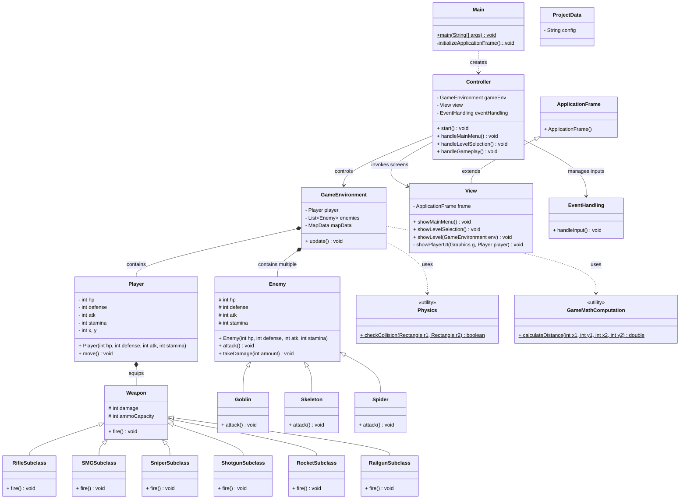

```mermaid
---
config:
  theme: mc
  layout: dagre
---
classDiagram

class Main {
    +main(String[] args)$ void
    -initializeApplicationFrame()$ void
}

class Controller {
    - GameEnvironment gameEnv
    - View view
    - EventHandling eventHandling
    + start() void
    + handleMainMenu() void
    + handleLevelSelection() void
    + handleGameplay() void
}

class GameEnvironment {
    - Player player
    - List~Enemy~ enemies
    - MapData mapData
    + update() void
}

class Player {
    - int hp
    - int defense
    - int atk
    - int stamina
    - int x, y
    + Player(int hp, int defense, int atk, int stamina)
    + move() void
}

class Weapon {
    # int damage
    # int ammoCapacity
    + fire() void
}

class RifleSubclass {
    + fire() void
}

class SMGSubclass {
    + fire() void
}

class SniperSubclass {
    + fire() void
}

class ShotgunSubclass {
    + fire() void
}

class RocketSubclass {
    + fire() void
}

class RailgunSubclass {
    + fire() void
}

class Enemy {
    # int hp
    # int defense
    # int atk
    # int stamina
    + Enemy(int hp, int defense, int atk, int stamina)
    + attack() void
    + takeDamage(int amount) void
}

class Goblin {
    + attack() void
}

class Skeleton {
    + attack() void
}

class Spider {
    + attack() void
}

class Physics {
    <<utility>>
    + checkCollision(Rectangle r1, Rectangle r2)$ boolean
}

class GameMathComputation {
    <<utility>>
    + calculateDistance(int x1, int y1, int x2, int y2)$ double
}

class ApplicationFrame {
    + ApplicationFrame()
}

class View {
    - ApplicationFrame frame
    + showMainMenu() void
    + showLevelSelection() void
    + showLevel(GameEnvironment env) void
    - showPlayerUI(Graphics g, Player player) void
}

class EventHandling {
    + handleInput() void
}

class ProjectData {
    - String config
}

%% Relationships
Main ..> Controller : creates
Controller --> GameEnvironment : controls
Controller --> View : invokes screens
ApplicationFrame <|-- View : extends
GameEnvironment *-- Player : contains
GameEnvironment *-- Enemy : contains multiple
Player *-- Weapon : equips
Weapon <|-- RifleSubclass
Weapon <|-- SMGSubclass
Weapon <|-- SniperSubclass
Weapon <|-- ShotgunSubclass
Weapon <|-- RocketSubclass
Weapon <|-- RailgunSubclass
Enemy <|-- Goblin
Enemy <|-- Skeleton
Enemy <|-- Spider
GameEnvironment ..> Physics : uses
GameEnvironment ..> GameMathComputation : uses
Controller --> EventHandling : manages inputs
```
