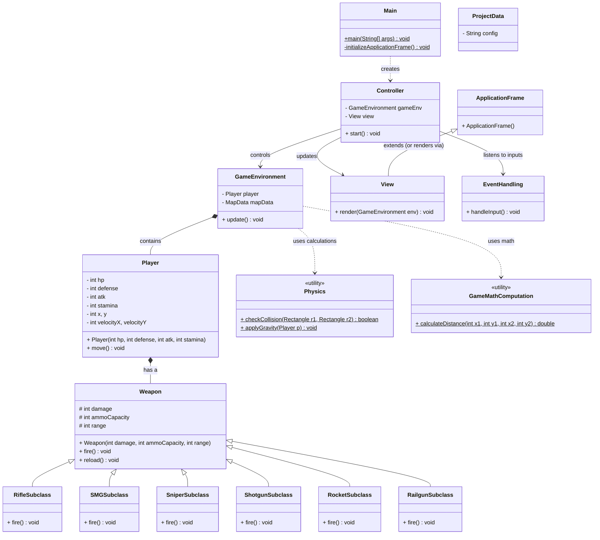

```mermaid
---
config:
  theme: mc
  layout: dagre
---
classDiagram

class Main {
    +main(String[] args)$ void
    -initializeApplicationFrame()$ void
}

class Controller {
    - GameEnvironment gameEnv
    - View view
    + start() void
}

class GameEnvironment {
    - Player player
    - MapData mapData
    + update() void
}

class Player {
    - int hp
    - int defense
    - int atk
    - int stamina
    - int x, y
    - int velocityX, velocityY
    + Player(int hp, int defense, int atk, int stamina)
    + move() void
}

class Weapon {
    # int damage
    # int ammoCapacity
    # int range
    + Weapon(int damage, int ammoCapacity, int range)
    + fire() void
    + reload() void
}

class RifleSubclass {
    + fire() void
}

class SMGSubclass {
    + fire() void
}

class SniperSubclass {
    + fire() void
}

class ShotgunSubclass {
    + fire() void
}

class RocketSubclass {
    + fire() void
}

class RailgunSubclass {
    + fire() void
}

%% Inheritance relationships
Weapon <|-- RifleSubclass
Weapon <|-- SMGSubclass
Weapon <|-- SniperSubclass
Weapon <|-- ShotgunSubclass
Weapon <|-- RocketSubclass
Weapon <|-- RailgunSubclass
class Physics {
    <<utility>>
    + checkCollision(Rectangle r1, Rectangle r2)$ boolean
    + applyGravity(Player p)$ void
}

class GameMathComputation {
    <<utility>>
    + calculateDistance(int x1, int y1, int x2, int y2)$ double
}

class ApplicationFrame {
    + ApplicationFrame()
}

class View {
    + render(GameEnvironment env) void
}

class EventHandling {
    + handleInput() void
}

class ProjectData {
    - String config
}

Main ..> Controller : creates
Controller --> GameEnvironment : controls
Controller --> View : updates
ApplicationFrame <|-- View : extends (or renders via)
GameEnvironment *-- Player : contains
Player *-- Weapon : has a
GameEnvironment ..> Physics : uses calculations
GameEnvironment ..> GameMathComputation : uses math
Controller --> EventHandling : listens to inputs
```
