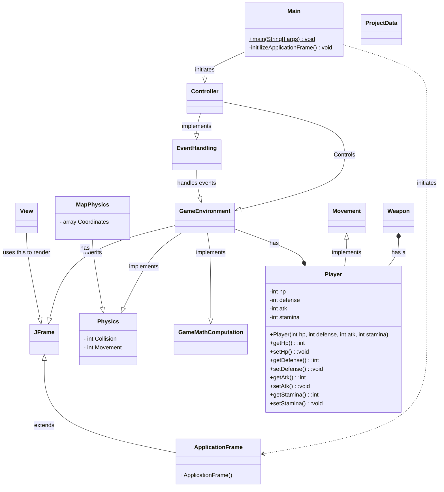

```mermaid
---
config:
  theme: mc
  layout: dagre
---
classDiagram

class ApplicationFrame{
    +ApplicationFrame()
}
JFrame<|--ApplicationFrame:extends

class Main{
    +main(String[] args)$ void
    -initilizeApplicationFrame()$ void
}
Main ..> ApplicationFrame : initiates
class GameEnvironment{
    
}
class Physics{
   - int Collision
   - int Movement
}

class MapPhysics {
    - array Coordinates
}

class GameMathComputation{

}

MapPhysics --|> Physics: inherits
View --|> JFrame: uses this to render
EventHandling --|> GameEnvironment: handles events
Controller --|> EventHandling: implements
Main --|> Controller: initiates
GameEnvironment --|> JFrame: has
Controller --|> GameEnvironment: Controls
GameEnvironment --* Player: has 
GameEnvironment --|> Physics: implements
GameEnvironment --|> GameMathComputation: implements
class Player{
    -int hp
    -int defense
    -int atk
    -int stamina
    
    +Player(int hp, int defense, int atk, int stamina)
    +getHp():int
    +setHp():void
    +getDefense():int
    +setDefense():void
    +getAtk():int
    +setAtk():void
    +getStamina():int
    +setStamina():void
    
}
Movement<|--Player:implements
class Movement{

}
Weapon*--Player: has a
class Weapon{
    
}
class Controller{

}
class EventHandling{

}
class ProjectData{

}

class View {

}
```
